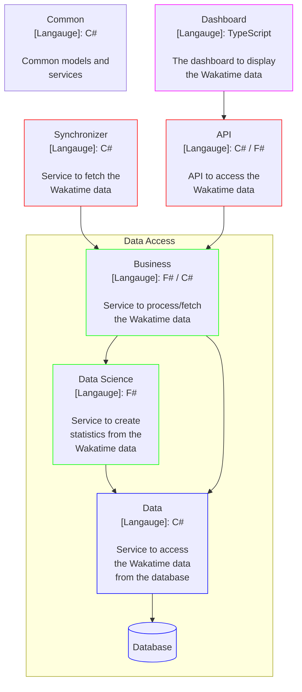

# Wakatime Stats

## Contents

| Section              | Description                  |
| -------------------- | ---------------------------- |
| [Structure](#structure) | The structure of the project |

## Structure

## Endpoints

### Heartbeat
<table>
    <thead>
        <tr>
            <th>HTTP Method</th>
            <th>Endpoint</th>
            <th>Description</th>
            <th>Request Body</th>
        </tr>
    </thead>
    <tbody>
        <tr>
            <td>GET</td>
            <td>/api/v1/Heartbeat</td>
            <td>Get all heartbeats from the database</td>
            <td></td>
        </tr>
        <tr>
            <td>POST</td>
            <td>/api/v1/Heartbeat</td>
            <td>Add a heartbeat to the database</td>
            <td>
                <pre lang="json">
{
    "id": 0,
    "wakatimeId": "string",
    "branch": "string",
    "category": "string",
    "createdAt": "string",
    "cursorpos": 0,
    "dependencies": [
        "string"
    ],
    "entity": "string",
    "isWrite": true,
    "language": "string",
    "lineno": 0,
    "lines": 0,
    "machineNameId": "string",
    "project": "string",
    "projectRootCount": 0,
    "time": 0,
    "type": "string",
    "userAgentId": "string",
    "userId": "string"
}
                </pre>
            </td>
        </tr>
        <tr>
            <td>GET</td>
            <td>/api/v1/Heartbeat/{id}</td>
            <td>Get a specific heartbeat from the database</td>
            <td></td>
        </tr>
        <tr>
            <td>PATCH</td>
            <td>/api/v1/Heartbeat/{id}</td>
            <td>Update a heartbeat in the database</td>
            <td>
                <pre lang="json">
{
    "id": 0,
    "wakatimeId": "string",
    "branch": "string",
    "category": "string",
    "createdAt": "string",
    "cursorpos": 0,
    "dependencies": [
        "string"
    ],
    "entity": "string",
    "isWrite": true,
    "language": "string",
    "lineno": 0,
    "lines": 0,
    "machineNameId": "string",
    "project": "string",
    "projectRootCount": 0,
    "time": 0,
    "type": "string",
    "userAgentId": "string",
    "userId": "string"
}
                </pre>
            </td>
        </tr>
        <tr>
            <td>DELETE</td>
            <td>/api/v1/Heartbeat/{id}</td>
            <td>Delete a heartbeat from the database</td>
            <td></td>
        </tr>
        <tr>
            <td>POST</td>
            <td>/api/v1/Heartbeat/range</td>
            <td>Add a range of heartbeats to the database</td>
            <td>
                <pre lang="json">
{
    "id": 0,
    "wakatimeId": "string",
    "branch": "string",
    "category": "string",
    "createdAt": "string",
    "cursorpos": 0,
    "dependencies": [
        "string"
    ],
    "entity": "string",
    "isWrite": true,
    "language": "string",
    "lineno": 0,
    "lines": 0,
    "machineNameId": "string",
    "project": "string",
    "projectRootCount": 0,
    "time": 0,
    "type": "string",
    "userAgentId": "string",
    "userId": "string"
}
                </pre>
            </td>
        </tr>  
    </tbody>
</table>